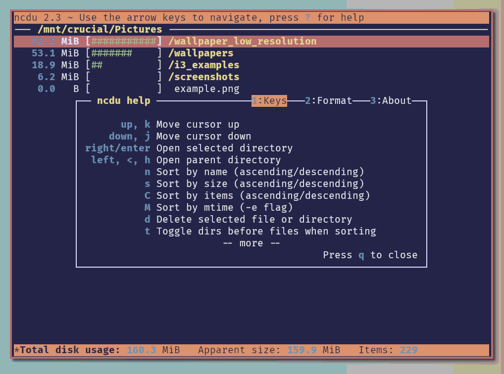
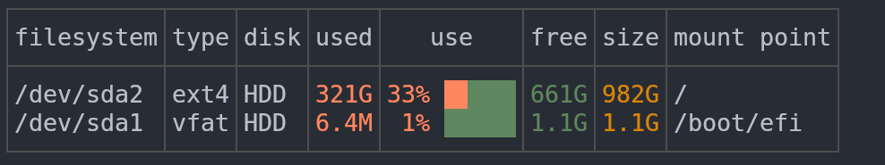

# df

The `df` (disk free) command displays disk usage of mounted file systems. It reports total, used, available space and the percentage of usage.
```bash
Filesystem     1K-blocks      Used Available Use% Mounted on
/dev/sda1      103081248  75123456  22698328  77% /
tmpfs            8165424         0   8165424   0% /dev/shm
/dev/sdb1      515928320 412345678  77339058  85% /home
```

Useful options:
- `df -h`: displays sizes in human-readable format (GB, MB)
- `df -T`: includes file system type
- `df -i`: shows inode usage instead of blocks

# ncdu

The `ncdu` (NCurses Disk Usage) command is a modern interactive tool for analyzing disk usage. It recursively scans directories and presents results in a navigable interface where you can explore which folders and files take up the most space.



Key features:
- Intuitive navigation with arrow keys
- Sort by size
- Delete files directly from the interface
- Real-time scan visualization

### Installation

```bash
sudo apt install ncdu
```

# dysk

The `dysk` command is an alternative to `df` that provides a more visual and user-friendly display of disk usage. It shows file systems with colored bars representing usage levels, making it easier to quickly identify storage issues.



Key features:
- Color-coded usage bars for quick visualization
- Clean, modern output format
- Shows filesystem type, mount points, and usage statistics
- Highlights critical usage levels


Useful options:
- `dysk`: displays all mounted filesystems
- `dysk --only-local`: shows only local filesystems (excludes network mounts)
- `dysk --all`: includes pseudo, duplicate and inaccessible filesystems
- `dysk --units M`: displays sizes in specific units (K, M, G, T)

```bash
# displays all mounted filesystems
dysk
#See the disk of the current directory:
dysk .
#shows only local filesystems (excludes network mounts)
dysk --only-local
#includes pseudo, duplicate and inaccessible filesystems
dysk --all
#displays sizes in specific units valid values are 'SI', 'binary', and 'bytes'
dysk -u <UNIT>
```

### Installation

```bash
#Download executable to /usr/local/bin directory:
sudo wget -qO /usr/local/bin/dysk https://dystroy.org/dysk/download/x86_64-linux/dysk
#Set execute permission for file:
sudo chmod a+x /usr/local/bin/dysk
# see version
dysk --version
```

